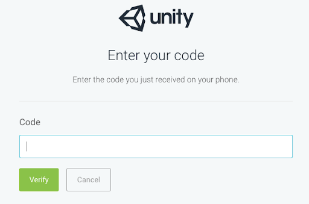

[](https://opensource.org/licenses/MIT)
[](https://github.com/jcs090218/unity-verify-code/releases/latest)
[](https://www.npmjs.com/package/unity-verify-code)
[](https://npmcharts.com/compare/unity-verify-code?minimal=true)
[](https://npmcharts.com/compare/unity-verify-code?minimal=true)

# unity-verify-code

[](https://david-dm.org/jcs090218/unity-verify-code)

An email parser to get 6 digit verification code.

This tool is design to use with [unity-license-activate](https://github.com/jcs090218/unity-license-activate)
so you can feed verification code to get pass Unity's TFA.

<p align="center">
  
</p>

## 💾 Prerequisite

This application uses IMAP to parse your verification email from Unity, so make
sure your email's IMAP service is enabled!

* `Gmail`, see [How Can i receive incoming mails(gmail) to my application server using imap (nodejs)](https://stackoverflow.com/questions/62404008/how-can-i-receive-incoming-mailsgmail-to-my-application-server-using-imap-nod)

*P.S. All email services should have the similar steps!*

### 📬 Supported mail services

| Name    | Done | Value                   |
|---------|------|-------------------------|
| Gmail   | ✔    | `imap.gmail.com`        |
| Hotmail | ✔    | `imap-mail.outlook.com` |
| Outlook | ✔    | `imap-mail.outlook.com` |
| Yahoo   | ✔    | `imap.mail.yahoo.com`   |
| Foxmail | ✔    | `imap.qq.com`           |
| QQ      | ✔    | `imap.qq.com`           |

## 🔨 How to use?

You can use these tools with any CI/CD system as long as you have the [Node](https://nodejs.org/en/)
environment set up! Here is an example of GitHub Actions.

```yml
jobs:
  acquire_ulf:
    name: Acquire .ulf file 🔑
    runs-on: ubuntu-latest
    strategy:
      matrix:
        node-version: [14.x]
    steps:
      - name: Set up Node.js ${{ matrix.node-version }}
        uses: actions/setup-node@v1
        with:
          node-version: ${{ matrix.node-version }}

      - name: Install node package, `unity-license-activate`
        run: npm install --global unity-license-activate

      # You would only have to install it!
      - name: Install node package, `unity-verify-code`
        run: npm install --global unity-verify-code

      - name: Activate the license
        run: unity-license-activate "${{ secrets.UNITY_EMAIL }}" "${{ secrets.UNITY_PASSWORD }}" "${{ needs.request_alf.outputs.alf }}"
```

See the full example [here](https://github.com/jcs090218/JCSUnity/blob/master/.github/workflows/license.yml).

## 📇 Command Line Arguments

```console
usage : unity-verify-code [--port] [--tls]
                          EMAIL [EMAIL ...] PASSWORD [PASSWORD ...] HOST [HOST ...]
                          SAVE_PATH [SAVE_PATH ...]

Unity License Activate : An email parser to get 6 digit verification code.

positional arguments:
  EMAIL          Username or Email you use to register for Unity account
  PASSWORD       Password to login Unity account
  SAVE_PATH      File path to save the 6 digit code.

optional arguments:
  --port         Port number of the IMAP server. Default: 143
  --tls          boolean - Perform implicit TLS connection? Default: false
```

## ⚜️ License

Copyright (c) 2021-2024 Jen-Chieh Shen

Permission is hereby granted, free of charge, to any person obtaining a copy
of this software and associated documentation files (the "Software"), to deal
in the Software without restriction, including without limitation the rights
to use, copy, modify, merge, publish, distribute, sublicense, and/or sell
copies of the Software, and to permit persons to whom the Software is
furnished to do so, subject to the following conditions:

The above copyright notice and this permission notice shall be included in all
copies or substantial portions of the Software.

THE SOFTWARE IS PROVIDED "AS IS", WITHOUT WARRANTY OF ANY KIND, EXPRESS OR
IMPLIED, INCLUDING BUT NOT LIMITED TO THE WARRANTIES OF MERCHANTABILITY,
FITNESS FOR A PARTICULAR PURPOSE AND NONINFRINGEMENT. IN NO EVENT SHALL THE
AUTHORS OR COPYRIGHT HOLDERS BE LIABLE FOR ANY CLAIM, DAMAGES OR OTHER
LIABILITY, WHETHER IN AN ACTION OF CONTRACT, TORT OR OTHERWISE, ARISING FROM,
OUT OF OR IN CONNECTION WITH THE SOFTWARE OR THE USE OR OTHER DEALINGS IN THE
SOFTWARE.

See [`LICENSE`](./LICENSE) for details.
